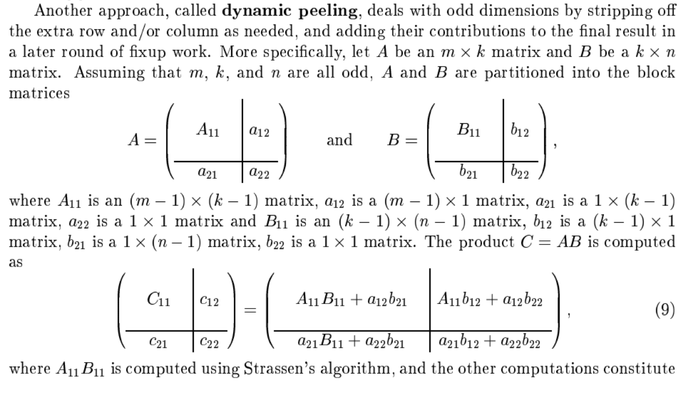
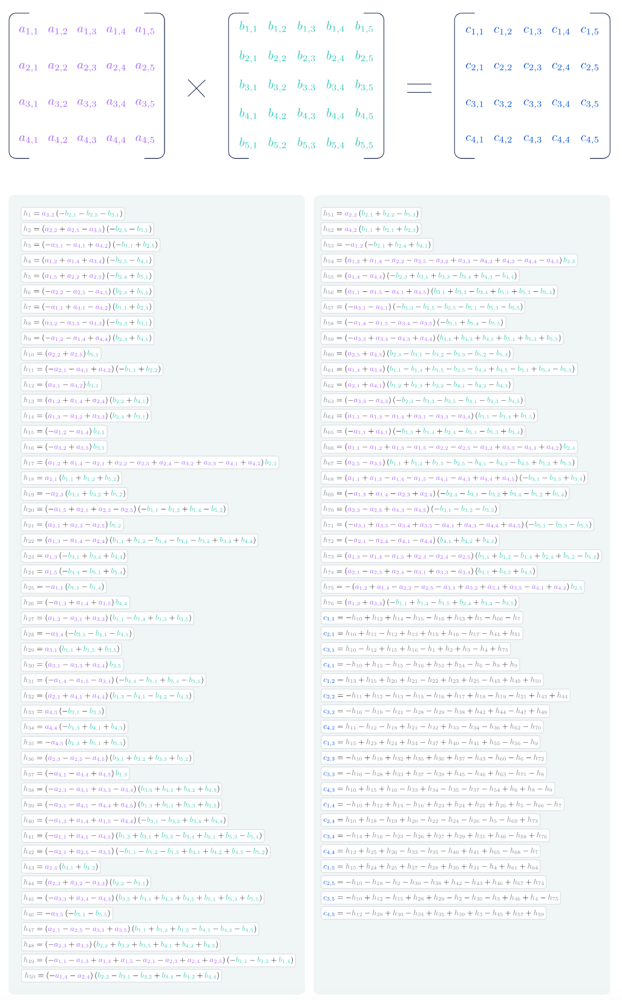

# Algorytmy Macierzowe

## Sprawozdanie nr 1 

## 23.10.2024

## Mateusz Król, Natalia Bratek
## gr. 3

## Spis treści
1. [Polecenie](#polecenie)
2. [Algorytm Binet’a](#binet)
    2.1 [Opis algorytmu](#binet_opis)
    2.2. [Pseudokod](#binet_pseudo)
    2.3. [Fragment kodu](#binet_fragment)
3. [Algorytm Strassen’a](#strassen)
    3.1. [Opis algorytmu](#strassen_opis)
    3.2. [Pseudokod](#strassen_pseudo)
    3.3. [Fragment kodu](#strassen_fragment)
4. [Algorytm zaproponowany przez sztuczną inteligencję](#ai)
    4.1. [Opis algorytmu](#ai_opis)
    4.2. [Pseudokod](#ai_pseudo)
    4.3. [Fragment kodu](#ai_fragment)
5. [Wykresy](#wykresy)
6. [Szacowanie złożoności obliczeniowej](#complexity)
7. [Wnioski](#wnioski)
8. [Bibliografia](#biblio)


## 1. Polecenie <a name="polecenie"></a>

Proszę wybrać ulubiony język programowania, wygenerować macierze losowe o wartościach z przedziału otwartego (0.00000001, 1.0) i zaimplementować:
- Rekurencyjne mnożenie macierzy metodą Binét’a 
- Rekurencyjne mnożenie macierzy metodą Strassena 
- Mnożenie macierzy metodą AI na podstawie artykułu w Nature 

Proszę zliczać liczbę operacji zmiennoprzecinkowych (+-*/ liczb) wykonywanych podczas mnożenia macierzy.

## 2. Algorytm Binet’a <a name="binet"></a>

### 2.1 Opis algorytmu  <a name="binet_opis"></a>

Zakładamy, że mamy dwie macierze A i B o wymiarach n x n. 
Chcemy wyznaczyć macierz C, będącą iloczynem macierzy A i B, czyli C = A ׁᐧ B. Algorytm Binet’a polega na rozbiciu macierzy na mniejsze bloki, a następnie mnożeniu tych bloków i sumowaniu ich zgodnie z zasadami mnożenia macierzy. Po wykonaniu obliczeń dla wszystkich bloków, wyniki są łączone w macierz C. W naszej implementacji wykorzystujemy mechanizm *dynamic peeling*:



### 2.2 Pseudokod  <a name="binet_pseudo"></a>
# TODO : correct pseudocode
		binet(A, B)
			Jeśli macierze A i B mają rozmiar 1
				zwróć wynik A * B 

			W przeciwnym przypadku: 
				wykonaj podział macierzy A i B na równe 4 bloki: A11, A12, A21, A22 oraz B11, B12, B21, B22

				wykonaj mnożenie bloków i dodawanie wyników
				C11 = binet(A11, B11) + binet(A12, B21) 
				C12 = binet(A11, B12) + binet(A12, B22) 
				C21 = binet(A21, B11) + binet(A22, B21) 
				C22 = binet(A21, B12) + binet(A22, B22) 

				zwróć połączone bloki (C11, C12, C21, C22)


### 2.3 Fragment kodu  <a name="binet_fragment"></a>
 
```python
def __binet(self, A, B):
	n = len(A)
	if n == 1:
		return self.calculator.standard_matrix_multiplication(A, B)
	if n % 2 == 1:
		A11, A12, A21, A22 = self.calculator.split_into_block_matrices_dynamic_peeling(A)
		B11, B12, B21, B22 = self.calculator.split_into_block_matrices_dynamic_peeling(B)

		C11 = self.calculator.add(self.__binet(A11, B11), self.calculator.standard_matrix_multiplication(A12, B21))
		C12 = self.calculator.add(self.calculator.standard_matrix_multiplication(A11, B12), self.calculator.standard_matrix_multiplication(A12, B22))
		C21 = self.calculator.add(self.calculator.standard_matrix_multiplication(A21, B11), self.calculator.standard_matrix_multiplication(A22, B21))
		C22 = self.calculator.add(self.calculator.standard_matrix_multiplication(A21, B12), self.calculator.standard_matrix_multiplication(A22, B22))

		return self.calculator.connect_block_matrices_dynamic_peeling(C11, C12, C21, C22)
	else:
		A11, A12, A21, A22 = self.calculator.split_into_block_matrices(A)
		B11, B12, B21, B22 = self.calculator.split_into_block_matrices(B)

		C11 = self.calculator.add(self.__binet(A11, B11), self.__binet(A12, B21))
		C12 = self.calculator.add(self.__binet(A11, B12), self.__binet(A12, B22))
		C21 = self.calculator.add(self.__binet(A21, B11), self.__binet(A22, B21))
		C22 = self.calculator.add(self.__binet(A21, B12), self.__binet(A22, B22))

		return self.calculator.connect_block_matrices(C11, C12, C21, C22)
```

## 3. Algorytm Strassen’a <a name="strassen"></a>

### 3.1 Opis algorytmu <a name="strassen_opis"></a>
Algorytm Strassena polega na podzieleniu macierzy A i B na 4 podmacierze. Tworzone są pomocnicze macierze P1,P2, P3, P4, P5, P6, P7 poprzez dodawanie, odejmowanie i mnożenie odpowiednich podmacierzy. Wynikowa macierz C jest konstruowana na podstawie pomocniczych macierzy P1, P2, P3, P4, P5, P6, P7​. Te macierze pośrednie są wykorzystywane do obliczenia poszczególnych bloków macierzy wynikowej C11, C12, C21, C22. Po obliczeniu tych bloków, są one łączone w pełną macierz wynikową C.

### 3.2 Pseudokod <a name="strassen_pseudo"></a>
		strassen(matrix_1, matrix_2)
			Jeśli macierz matrix_1 ma rozmiar 1 
				to zwróć matrix_1 * matrix_2 
			
			W przeciwnym przypadku: 
				wykonaj podział macierzy matrix_1 i matrix_2 na równe 4 bloki:
				matrix_1_11, matrix_1_12, matrix_1_21, matrix_1_22 oraz matrix_2_11, matrix_2_12, matrix_2_21, matrix_2_22

				oblicz pomocnicze macierze:
				p_1 = strassen(matrix_1_11+matrix_1_22 , matrix_2_11+matrix_2_22)
				p_2 = strassen(matrix_1_21 + matrix_1_22, matrix_2_11) 
				p_3 = strassen(matrix_1_11,matrix_2_12 - matrix_2_22) 
				p_4 = strassen(matrix_1_22,matrix_2_21 - matrix_2_11)
				p_5 = strassen(matrix_1_11+matrix_1_12, matrix_2_22) 
				p_6 = strassen(matrix_1_21 - matrix_1_1, matrix_2_11+matrix_2_12)
				p_7 = strassen(matrix_1_12 - matrix_1_22, matrix_2_21 + matrix_2_22)

				oblicz bloki wynikowej macierzy:
				matrix_3_11 = p_1 + p_4 -  p_5 + p_7
				matrix_3_12 = p_3 + p_5
				matrix_3_21 = p_2 + p_4
				matrix_3_22 = p_1 + p_3 - p_2 + p_6

				połącz bloki (matrix_3_11, matrix_3_12, matrix_3_21, matrix_3_22) w jedną macierz matrix_3

				zwróć matrix_3
	


### 3.3 Fragment kodu <a name="strassen_fragment"></a>


```python
def __rec(self, matrix_1, matrix_2):
	if len(matrix_1) == 1:
		return self.calculator.multiply_one_by_one_matrices(matrix_1, matrix_2)

	matrix_1_11, matrix_1_12, matrix_1_21, matrix_1_22 = self.calculator.split_into_block_matrices(matrix_1)
	matrix_2_11, matrix_2_12, matrix_2_21, matrix_2_22 = self.calculator.split_into_block_matrices(matrix_2)

	p_1 = self.__rec(self.calculator.add(matrix_1_11, matrix_1_22), self.calculator.add(matrix_2_11, matrix_2_22))
	p_2 = self.__rec(self.calculator.add(matrix_1_21, matrix_1_22), matrix_2_11)
	p_3 = self.__rec(matrix_1_11, self.calculator.subtract(matrix_2_12, matrix_2_22))
	p_4 = self.__rec(matrix_1_22, self.calculator.subtract(matrix_2_21, matrix_2_11))
	p_5 = self.__rec(self.calculator.add(matrix_1_11, matrix_1_12), matrix_2_22)
	p_6 = self.__rec(self.calculator.subtract(matrix_1_21, matrix_1_11), self.calculator.add(matrix_2_11, matrix_2_12))
	p_7 = self.__rec(self.calculator.subtract(matrix_1_12, matrix_1_22), self.calculator.add(matrix_2_21, matrix_2_22))

	matrix_3_11 = self.calculator.add(self.calculator.subtract(self.calculator.add(p_1, p_4), p_5), p_7)
	matrix_3_12 = self.calculator.add(p_3, p_5)
	matrix_3_21 = self.calculator.add(p_2, p_4)
	matrix_3_22 = self.calculator.add(self.calculator.add(self.calculator.subtract(p_1, p_2), p_3), p_6)

	matrix_3 = self.calculator.connect_block_matrices(matrix_3_11, matrix_3_12, matrix_3_21, matrix_3_22)
	return matrix_3
```

	
## 4. Algorytm zaproponowany przez sztuczną inteligencję <a name="ai"></a>

### 4.1 Opis algorytmu <a name="ai_opis"></a>

Algorytm działa w oparciu o uczenie maszynowe, gdzie proces odkrywania nowych, wydajnych algorytmów mnożenia macierzy został przekształcony w grę jednoosobową. W tej grze stan początkowy to trójwymiarowy tensor, który reprezentuje aktualny stan algorytmu. Gracz (czyli model) wykonuje dozwolone ruchy, które odpowiadają instrukcjom algorytmicznym, aby doprowadzić tensor do stanu zerowego. Ostatecznym celem jest znalezienie poprawnego algorytmu mnożenia macierzy, który jest oceniany na podstawie liczby wykonanych kroków.
Grę tę rozwiązywał agent AlphaTensor, który na początku nie posiadał wiedzy o istniejących algorytmach. Poprzez uczenie wzmacniające, AlphaTensor odkrywał coraz lepsze algorytmy, w tym ponownie odkrywał znane algorytmy, takie jak Strassen. 
Tradycyjny algorytm mnoży macierz 4x5 przez 5x5 za pomocą 100 mnożeń. Liczbę tę udało się zmniejszyć do 80 za pomocą metody Strassena, a AlphaTensor znalazł algorytmy, które wykonują tę samą operację, wykonując 76 mnożeń.



### 4.2 Pseudokod <a name="ai_pseudo"></a>
	ai(A, B)
		Sprawdź, czy wymiary macierzy są odpowiednie do mnożenia.
		Jeśli rozmiary macierzy są mniejsze niż wymagane ( mniejsze niż 4x5 i 5x5), wykonaj standardowe mnożenie macierzy.
		Jeśli rozmiary są większe, przeskaluj macierze do potęg liczb (4 i 5) poprzez dodanie dodatkowych wierszy i kolumn z zerami.

		Podziel macierze A i B na mniejsze bloki, tak aby można było  wykonywać na nich operacje.
		Oblicz zestaw pomocniczych wartości h na podstawie elementów macierzy A i B. 
		Wykorzystaj pomocnicze wartości h do obliczenia wynikowych bloków macierzy C.
		Po obliczeniu bloków wynikowej macierzy, połącz je w jedną macierz wynikową C.
		Zwróć wynikową macierz C po zakończeniu wszystkich operacji.


### 4.3 Fragmenty kodu <a name="ai_fragment"></a>

```python
def ai_compute_c(self, h, multiplication):
	c = Matrix.empty(4, 5, self.calculator, multiplication=multiplication)

	c[1, 1] = -h[10] + h[12] + h[14] - h[15] - h[16] + h[53] + h[5] - h[66] - h[7]
	c[2, 1] = h[10] + h[11] - h[12] + h[13] + h[15] + h[16] - h[17] - h[44] + h[51]
	c[3, 1] = h[10] - h[12] + h[15] + h[16] - h[1] + h[2] + h[3] - h[4] + h[75]
	c[4, 1] = -h[10] + h[12] - h[15] - h[16] + h[52] + h[54] - h[6] - h[8] + h[9]
	c[1, 2] = h[13] + h[15] + h[20] + h[21] - h[22] + h[23] + h[25] - h[43] + h[49] + h[50]
	c[2, 2] = -h[11] + h[12] - h[13] - h[15] - h[16] + h[17] + h[18] - h[19] - h[21] + h[43] + h[44]
	c[3, 2] = -h[16] - h[19] - h[21] - h[28] - h[29] - h[38] + h[42] + h[44] - h[47] + h[48]
	c[4, 2] = h[11] - h[12] - h[18] + h[21] - h[32] + h[33] - h[34] - h[36] + h[62] - h[70]
	c[1, 3] = h[15] + h[23] + h[24] + h[34] - h[37] + h[40] - h[41] + h[55] - h[56] - h[9]
	c[2, 3] = -h[10] + h[19] + h[32] + h[35] + h[36] + h[37] - h[43] - h[60] - h[6] - h[72]
	c[3, 3] = -h[16] - h[28] + h[33] + h[37] - h[39] + h[45] - h[46] + h[63] - h[71] - h[8]
	c[4, 3] = h[10] + h[15] + h[16] - h[33] + h[34] - h[35] - h[37] - h[54] + h[6] + h[8] - h[9]
	c[1, 4] = -h[10] + h[12] + h[14] - h[16] + h[23] + h[24] + h[25] + h[26] + h[5] - h[66] - h[7]
	c[2, 4] = h[10] + h[18] - h[19] + h[20] - h[22] - h[24] - h[26] - h[5] - h[69] + h[73]
	c[3, 4] = -h[14] + h[16] - h[23] - h[26] + h[27] + h[29] + h[31] + h[46] - h[58] + h[76]
	c[4, 4] = h[12] + h[25] + h[26] - h[33] - h[35] - h[40] + h[41] + h[65] - h[68] - h[7]
	c[1, 5] = h[15] + h[24] + h[25] + h[27] - h[28] + h[30] + h[31] - h[4] + h[61] + h[64]
	c[2, 5] = -h[10] - h[18] - h[2] - h[30] - h[38] + h[42] - h[43] + h[46] + h[67] + h[74]
	c[3, 5] = -h[10] + h[12] - h[15] + h[28] + h[29] - h[2] - h[30] - h[3] + h[46] + h[4] - h[75]
	c[4, 5] = -h[12] - h[29] + h[30] - h[34] + h[35] + h[39] + h[3] - h[45] + h[57] + h[59]

	return c
```

```python
@staticmethod
def ai_compute_h(a, b):
	h = [None] * 77
	h[1] = (a[3, 2]) * (-b[2, 1] - b[2, 5] - b[3, 1])
	h[2] = (a[2, 2] + a[2, 5] - a[3, 5]) * (-b[2, 5] - b[5, 1])
	h[3] = (-a[3, 1] - a[4, 1] + a[4, 2]) * (-b[1, 1] + b[2, 5])
	h[4] = (a[1, 2] + a[1, 4] + a[3, 4]) * (-b[2, 5] - b[4, 1])
	h[5] = (a[1, 5] + a[2, 2] + a[2, 5]) * (-b[2, 4] + b[5, 1])
	h[6] = (-a[2, 2] - a[2, 5] - a[4, 5]) * (b[2, 3] + b[5, 1])
	h[7] = (-a[1, 1] + a[4, 1] - a[4, 2]) * (b[1, 1] + b[2, 4])
	h[8] = (a[3, 2] - a[3, 3] - a[4, 3]) * (-b[2, 3] + b[3, 1])
	h[9] = (-a[1, 2] - a[1, 4] + a[4, 4]) * (b[2, 3] + b[4, 1])
	h[10] = (a[2, 2] + a[2, 5]) * (b[5, 1])
	h[11] = (-a[2, 1] - a[4, 1] + a[4, 2]) * (-b[1, 1] + b[2, 2])
	h[12] = (a[4, 1] - a[4, 2]) * (b[1, 1])
	h[13] = (a[1, 2] + a[1, 4] + a[2, 4]) * (b[2, 2] + b[4, 1])
	h[14] = (a[1, 3] - a[3, 2] + a[3, 3]) * (b[2, 4] + b[3, 1])
	h[15] = (-a[1, 2] - a[1, 4]) * (b[4, 1])
	h[16] = (-a[3, 2] + a[3, 3]) * (b[3, 1])
	h[17] = (a[1, 2] + a[1, 4] - a[2, 1] + a[2, 2] - a[2, 3] + a[2, 4] - a[3, 2] + a[3, 3] - a[4, 1] + a[4, 2]) * (
		b[2, 2])
	h[18] = (a[2, 1]) * (b[1, 1] + b[1, 2] + b[5, 2])
	h[19] = (-a[2, 3]) * (b[3, 1] + b[3, 2] + b[5, 2])
	h[20] = (-a[1, 5] + a[2, 1] + a[2, 3] - a[2, 5]) * (-b[1, 1] - b[1, 2] + b[1, 4] - b[5, 2])
	h[21] = (a[2, 1] + a[2, 3] - a[2, 5]) * (b[5, 2])
	h[22] = (a[1, 3] - a[1, 4] - a[2, 4]) * (b[1, 1] + b[1, 2] - b[1, 4] - b[3, 1] - b[3, 2] + b[3, 4] + b[4, 4])
	h[23] = (a[1, 3]) * (-b[3, 1] + b[3, 4] + b[4, 4])
	h[24] = (a[1, 5]) * (-b[4, 4] - b[5, 1] + b[5, 4])
	h[25] = (-a[1, 1]) * (b[1, 1] - b[1, 4])
	h[26] = (-a[1, 3] + a[1, 4] + a[1, 5]) * (b[4, 4])
	h[27] = (a[1, 3] - a[3, 1] + a[3, 3]) * (b[1, 1] - b[1, 4] + b[1, 5] + b[3, 5])
	h[28] = (-a[3, 4]) * (-b[3, 5] - b[4, 1] - b[4, 5])
	h[29] = (a[3, 1]) * (b[1, 1] + b[1, 5] + b[3, 5])
	h[30] = (a[3, 1] - a[3, 3] + a[3, 4]) * (b[3, 5])
	h[31] = (-a[1, 4] - a[1, 5] - a[3, 4]) * (-b[4, 4] - b[5, 1] + b[5, 4] - b[5, 5])
	h[32] = (a[2, 1] + a[4, 1] + a[4, 4]) * (b[1, 3] - b[4, 1] - b[4, 2] - b[4, 3])
	h[33] = (a[4, 3]) * (-b[3, 1] - b[3, 3])
	h[34] = (a[4, 4]) * (-b[1, 3] + b[4, 1] + b[4, 3])
	h[35] = (-a[4, 5]) * (b[1, 3] + b[5, 1] + b[5, 3])
	h[36] = (a[2, 3] - a[2, 5] - a[4, 5]) * (b[3, 1] + b[3, 2] + b[3, 3] + b[5, 2])
	h[37] = (-a[4, 1] - a[4, 4] + a[4, 5]) * (b[1, 3])
	h[38] = (-a[2, 3] - a[3, 1] + a[3, 3] - a[3, 4]) * (b[3, 5] + b[4, 1] + b[4, 2] + b[4, 5])
	h[39] = (-a[3, 1] - a[4, 1] - a[4, 4] + a[4, 5]) * (b[1, 3] + b[5, 1] + b[5, 3] + b[5, 5])
	h[40] = (-a[1, 3] + a[1, 4] + a[1, 5] - a[4, 4]) * (-b[3, 1] - b[3, 3] + b[3, 4] + b[4, 4])
	h[41] = (-a[1, 1] + a[4, 1] - a[4, 5]) * (b[1, 3] + b[3, 1] + b[3, 3] - b[3, 4] + b[5, 1] + b[5, 3] - b[5, 4])
	h[42] = (-a[2, 1] + a[2, 5] - a[3, 5]) * (-b[1, 1] - b[1, 2] - b[1, 5] + b[4, 1] + b[4, 2] + b[4, 5] - b[5, 2])
	h[43] = (a[2, 4]) * (b[4, 1] + b[4, 2])
	h[44] = (a[2, 3] + a[3, 2] - a[3, 3]) * (b[2, 2] - b[3, 1])
	h[45] = (-a[3, 3] + a[3, 4] - a[4, 3]) * (b[3, 5] + b[4, 1] + b[4, 3] + b[4, 5] + b[5, 1] + b[5, 3] + b[5, 5])
	h[46] = (-a[3, 5]) * (-b[5, 1] - b[5, 5])
	h[47] = (a[2, 1] - a[2, 5] - a[3, 1] + a[3, 5]) * (b[1, 1] + b[1, 2] + b[1, 5] - b[4, 1] - b[4, 2] - b[4, 5])
	h[48] = (-a[2, 3] + a[3, 3]) * (b[2, 2] + b[3, 2] + b[3, 5] + b[4, 1] + b[4, 2] + b[4, 5])
	h[49] = (-a[1, 1] - a[1, 3] + a[1, 4] + a[1, 5] - a[2, 1] - a[2, 3] + a[2, 4] + a[2, 5]) * (
			-b[1, 1] - b[1, 2] + b[1, 4])
	h[50] = (-a[1, 4] - a[2, 4]) * (b[2, 2] - b[3, 1] - b[3, 2] + b[3, 4] - b[4, 2] + b[4, 4])
	h[51] = (a[2, 2]) * (b[2, 1] + b[2, 2] - b[5, 1])
	h[52] = (a[4, 2]) * (b[1, 1] + b[2, 1] + b[2, 3])
	h[53] = (-a[1, 2]) * (-b[2, 1] + b[2, 4] + b[4, 1])
	h[54] = (a[1, 2] + a[1, 4] - a[2, 2] - a[2, 5] - a[3, 2] + a[3, 3] - a[4, 2] + a[4, 3] - a[4, 4] - a[4, 5]) * (
		b[2, 3])
	h[55] = (a[1, 4] - a[4, 4]) * (-b[2, 3] + b[3, 1] + b[3, 3] - b[3, 4] + b[4, 3] - b[4, 4])
	h[56] = (a[1, 1] - a[1, 5] - a[4, 1] + a[4, 5]) * (b[3, 1] + b[3, 3] - b[3, 4] + b[5, 1] + b[5, 3] - b[5, 4])
	h[57] = (-a[3, 1] - a[4, 1]) * (-b[1, 3] - b[1, 5] - b[2, 5] - b[5, 1] - b[5, 3] - b[5, 5])
	h[58] = (-a[1, 4] - a[1, 5] - a[3, 4] - a[3, 5]) * (-b[5, 1] + b[5, 4] - b[5, 5])
	h[59] = (-a[3, 3] + a[3, 4] - a[4, 3] + a[4, 4]) * (b[4, 1] + b[4, 3] + b[4, 5] + b[5, 1] + b[5, 3] + b[5, 5])
	h[60] = (a[2, 5] + a[4, 5]) * (b[2, 3] - b[3, 1] - b[3, 2] - b[3, 3] - b[5, 2] - b[5, 3])
	h[61] = (a[1, 4] + a[3, 4]) * (
			b[1, 1] - b[1, 4] + b[1, 5] - b[2, 5] - b[4, 4] + b[4, 5] - b[5, 1] + b[5, 4] - b[5, 5])
	h[62] = (a[2, 1] + a[4, 1]) * (b[1, 2] + b[1, 3] + b[2, 2] - b[4, 1] - b[4, 2] - b[4, 3])
	h[63] = (-a[3, 3] - a[4, 3]) * (-b[2, 3] - b[3, 3] - b[3, 5] - b[4, 1] - b[4, 3] - b[4, 5])
	h[64] = (a[1, 1] - a[1, 3] - a[1, 4] + a[3, 1] - a[3, 3] - a[3, 4]) * (b[1, 1] - b[1, 4] + b[1, 5])
	h[65] = (-a[1, 1] + a[4, 1]) * (-b[1, 3] + b[1, 4] + b[2, 4] - b[5, 1] - b[5, 3] + b[5, 4])
	h[66] = (a[1, 1] - a[1, 2] + a[1, 3] - a[1, 5] - a[2, 2] - a[2, 5] - a[3, 2] + a[3, 3] - a[4, 1] + a[4, 2]) * (
		b[2, 4])
	h[67] = (a[2, 5] - a[3, 5]) * (
			b[1, 1] + b[1, 2] + b[1, 5] - b[2, 5] - b[4, 1] - b[4, 2] - b[4, 5] + b[5, 2] + b[5, 5])
	h[68] = (a[1, 1] + a[1, 3] - a[1, 4] - a[1, 5] - a[4, 1] - a[4, 3] + a[4, 4] + a[4, 5]) * (
			-b[3, 1] - b[3, 3] + b[3, 4])
	h[69] = (-a[1, 3] + a[1, 4] - a[2, 3] + a[2, 4]) * (-b[2, 4] - b[3, 1] - b[3, 2] + b[3, 4] - b[5, 2] + b[5, 4])
	h[70] = (a[2, 3] - a[2, 5] + a[4, 3] - a[4, 5]) * (-b[3, 1] - b[3, 2] - b[3, 3])
	h[71] = (-a[3, 1] + a[3, 3] - a[3, 4] + a[3, 5] - a[4, 1] + a[4, 3] - a[4, 4] + a[4, 5]) * (
			-b[5, 1] - b[5, 3] - b[5, 5])
	h[72] = (-a[2, 1] - a[2, 4] - a[4, 1] - a[4, 4]) * (b[4, 1] + b[4, 2] + b[4, 3])
	h[73] = (a[1, 3] - a[1, 4] - a[1, 5] + a[2, 3] - a[2, 4] - a[2, 5]) * (
			b[1, 1] + b[1, 2] - b[1, 4] + b[2, 4] + b[5, 2] - b[5, 4])
	h[74] = (a[2, 1] - a[2, 3] + a[2, 4] - a[3, 1] + a[3, 3] - a[3, 4]) * (b[4, 1] + b[4, 2] + b[4, 5])
	h[75] = -(a[1, 2] + a[1, 4] - a[2, 2] - a[2, 5] - a[3, 1] + a[3, 2] + a[3, 4] + a[3, 5] - a[4, 1] + a[4, 2]) * (
		b[2, 5])
	h[76] = (a[1, 3] + a[3, 3]) * (-b[1, 1] + b[1, 4] - b[1, 5] + b[2, 4] + b[3, 4] - b[3, 5])

	return h
```		

```python
def recursive_ai(self, a, b):
	# Scales up matrices to powers of 4 and 5 by appending zeroes
	if a.shape[0] < 4 or a.shape[1] < 5 or b.shape[0] < 5 or b.shape[1] < 5:
		return Matrix(self.calculator.standard_matrix_multiplication(a.data, b.data), self.calculator, multiplication=a.multiplication)
	n, k = a.shape
	k, m = b.shape
	a = self.rescale(a, shape=(self.power(n, 4), self.power(k, 5)))
	b = self.rescale(b, shape=(self.power(k, 5), self.power(m, 5)))
	a.multiplication = self.recursive_ai_rec
	b.multiplication = self.recursive_ai_rec
	retval = self.recursive_ai_rec(a, b)

	return self.submatrix(retval, yrange=(1, n + 1), xrange=(1, m + 1))
```

```python
def recursive_ai_rec(self, a, b):
	# Works only for powers of 4 and 5
	if a.shape[0] < 4 or a.shape[1] < 5 or b.shape[0] < 5 or b.shape[1] < 5:
		return Matrix(self.calculator.standard_matrix_multiplication(a.data, b.data), self.calculator, multiplication=a.multiplication)

	A = self.block(a, shape=(4, 5))
	B = self.block(b, shape=(5, 5))
	return self.expand(self.ai_multiplication(A, B))
```

## 5. Wykresy <a name="wykresy"></a>

# TODO

## 6. Szacowanie złożoności obliczeniowej  <a name="complexity"></a>
Szacowana złożoność obliczeniowa rekurencyjnego algorytmu mnożenia macierzy Bineta wynosi $O(n^3)$, ponieważ każde mnożenie bloków wymaga 8 rekurencyjnych mnożeń mniejszych macierzy. W wyniku rekurencji, rozmiar macierzy jest zmniejszany o połowę (do $\frac{n}{2}$) na każdym poziomie. Liczba poziomów rekurencji wynosi $\log(n)$ Dlatego całkowita liczba operacji mnożenia to $8^{\log_2(n)}$ , co upraszcza się do $O(n^3)$. 
W przypadku algorytmu Strassena liczba mnożeń na każdym poziomie rekurencji została zredukowana do 7 zamiast 8, co prowadzi do złożoności 
$O(n^{log_2(7)})$, czyli około $O(n^{2.81})$. 
Złożoność algorytmu AI będzie mieściła się w przedziale między $O(n^3)$ a $O(n^{2.81})$, bliżej dolnej granicy dzięki wykorzystaniu bloków o określonych rozmiarach i optymalizacji operacji na blokach.
 


	
## 7. Wnioski  <a name="wnioski"></a>
- Algorytm Strassena jest lepszy pod względem wydajności niż klasyczny algorytm Bineta
- Klasyczny algorytm Bineta jest najprostszy, ale przy dużych macierzach jest niepraktyczny
- Algorytm stworzony przez sztuczną inteligencję posiada optymalizacje, takie jak dzielenie macierzy na bloki i skalowanie ich, aby dopasować ich rozmiar do efektywnych operacji blokowych

## 8. Bibliografia  <a name="biblio"></a>
- Wykłady prof. dr hab. Macieja Paszyńskiego (https://home.agh.edu.pl/~paszynsk/RM/RachunekMacierzowy1.pdf)
- https://www.researchgate.net/publication/2779622_Implementation_of_Strassen's_Algorithm_for_Matrix_Multiplication
- https://deepmind.google/discover/blog/discovering-novel-algorithms-with-alphatensor/#:~:text=In%20our%20paper,%20published%20today%20in%20Nature,%20we


