# Algorytmy Macierzowe

## Sprawozdanie nr 2

## 06.11.2024

## Mateusz Król, Natalia Bratek
## gr. 3


## Spis treści
1. [Polecenie](#polecenie)
2. [Rekurencyjne odwracanie macierzy](#inverse)
   1. [Opis algorytmu](#inversion_opis)
    2. [Pseudokod](#inversion_pseudo)
    3. [Fragment kodu](#inversion_fragment)
3. [Eliminacja Gaussa](#gauss)
    1. [Opis algorytmu](#gauss_opis)
    2. [Pseudokod](#gauss_pseudo)
    3. [Fragment kodu](#gauss_fragment)
4. [LU Faktoryzacja](#lu)
    1. [Opis algorytmu](#lu_opis)
    2. [Pseudokod](#lu_pseudo)
    3. [Fragment kodu](#lu_fragment)
5. [Obliczanie wyznacznika](#det)
    1. [Opis algorytmu](#det_opis)
    2. [Pseudokod](#det_pseudo)
    3. [Fragment kodu](#det_fragment)
6. [Wykresy](#wykresy)
   1. [Wykres dla rekurencyjnego odwracania macierzy](#inverse_plot)
   2. [Wykres dla rekurencyjnej eliminacji Gaussa](#gauss_plot)
   3. [Wykres dla rekurencyjnej faktoryzacji LU](#lu_plot)
   4. [Wykres dla rekurencyjnego obliczania wyznacznika macierzy](#det_plot)
7. [Szacowanie złożoności obliczeniowej](#complexity)
    1. [Algorytm rekurencyjnego odwracania macierzy](#inverse-complexity)
    2. [Eliminacja Gaussa](#gauss-complexity)
    3. [Faktoryzacja LU](#lu-complexity)
    4. [Wyznacznik macierzy](#det-complexity)
8. [Porównanie wyników z Matlabem](#matlab)
   1. [Odwracanie macierzy](#inversion_matlab)
   2. [Eliminacja Gaussa](#gauss_matlab)
   3. [LU Faktoryzacja](#lu_matlab)
   4. [Wyznacznik macierzy](#det_matlab)
9. [Wnioski](#wnioski)
10. [Bibliografia](#biblio)

## 1. Polecenie <a name="polecenie"></a>

Proszę wybrać ulubiony język programowania, wygenerować macierze losowe o wartościach z przedziału otwartego (0.00000001, 1.0) i zaimplementować:
- Rekurencyjne odwracanie macierzy
- Rekurencyjna eliminacja Gaussa 
- Rekurencyjna LU faktoryzacja 
- Rekurencyjne liczenie wyznacznika

Proszę zliczać liczbę operacji zmiennoprzecinkowych (+-*/ liczb) wykonywanych podczas mnożenia macierzy.


## 2. Rekurencyjne odwracanie macierzy <a name="inverse"></a>

### 2.1 Opis algorytmu  <a name="inversion_opis"></a>
Rekurencyjne odwracanie macierzy polega na podzieleniu macierzy A na 4 podmacierze A11, A12, A21, A22 i wyznaczeniu odwrotności macierzy A11.  Kolejnym krokiem jest obliczenie tzw. macierzy *Schura* S22, która także jest odwracana rekurencyjnie. 
Wykorzystując algorytm Bineta z poprzedniego laboratorium, wykonujemy mnożenia na poszczególnych podmacierzach, aby uzyskać ostateczne bloki odwrotności: B11, B12, B21 oraz B22. Na koniec wszystkie bloki są składane w jedną macierz wynikową, która stanowi odwrotność macierzy A.


### 2.2 Pseudokod  <a name="inversion_pseudo"></a>

      inverse(matrix)
	     Jeżeli matrix ma rozmiar 1 
		    zwróć 1/matrix

	     Podziel matrix na bloki A11, A12, A21, A22
      
         Rekurencyjnie wywołaj inverse na A11
                A11_inv = inverse(A11)
         Oblicz pomocniczą macierz  S22
                S22 = A22 - (A21 * A11_inv * A12)
         Rekurencyjnie oblicz odwrotność macierzy S22
               S22_inv = inverse(S22)
         Oblicz bloki B11, B12, B21, B22
                B11 = A11_inv + (A11_inv * A12 * S22_inv * A21 * A11_inv)
                B12 = -A11_inv * A12 * S22_inv
                B21 = -S22_inv * A21 * A11_inv
                B22 = S22_inv
         Zwróć połączone bloki B11, B12, B21, B22
             


### 2.3 Fragmenty kodu  <a name="inversion_fragment"></a>

```python
def __rec_inverse(self, A):
    if A.shape[0] == 1:
        return self.calc.inverse_one_by_one_matrix(A)

    A11, A12, A21, A22 = self.calc.split_into_block_matrices(A)

    A11_inv = self.__rec_inverse(A11)

    A11_inv_A12 = self.binet.mul(A11_inv, A12)
    A21_A11_inv = self.binet.mul(A21, A11_inv)
    S = self.calc.subtract(A22, self.binet.mul(A21_A11_inv, A12))

    S_inv = self.__rec_inverse(S)

    B11 = self.calc.add(A11_inv, self.binet.mul(self.binet.mul(A11_inv_A12, S_inv), A21_A11_inv))
    B12 = self.calc.negate(self.binet.mul(A11_inv_A12, S_inv))
    B21 = self.calc.negate(self.binet.mul(S_inv, A21_A11_inv))
    B22 = S_inv

    return self.calc.connect_block_matrices(B11, B12, B21, B22)

def assert_matrix_inversion_is_correct(matrix, inverse_matrix):
    epsilon = 1e-9
    n = matrix.shape[0]
    expected_inverse_matrix = scipy.linalg.inv(matrix)
    for i in range(n):
        for j in range(n):
            assert abs(expected_inverse_matrix[i, j] - inverse_matrix[i, j]) < epsilon,  f"Matrix inversion wasn't successful: expected_inverse_matrix[{i},{j}] = {expected_inverse_matrix[i,j]} != inverse_matrix[{i},{j}] = {inverse_matrix[i,j]}"
    print("Matrix inversion was successful!")
```

## 3. Eliminacja Gaussa <a name="gauss"></a>

### 3.1 Opis algorytmu  <a name="gauss_opis"></a>

Rekurencyjna eliminacja *Gaussa* rozwiązuje układ równań liniowych, dzieląc macierz A na mniejsze bloki i upraszczając układ przez eliminację. 
W każdym kroku wykonuje się faktoryzację LU dla bloku A11, a następnie oblicza się macierz *Schura* S, która zawiera zaktualizowane elementy pozostałe po eliminacji. Proces powtarzany jest rekurencyjnie dla S, aż cały układ zostanie sprowadzony do postaci trójkątnej. 

### 3.2 Pseudokod  <a name="gauss_pseudo"></a>

    Gauss(A, b)
	    Jeżeli matrix ma rozmiar 1 
		    Zwróć A, b

	    Podziel macierz A na bloki A11, A12, A21, A22
	    Podziel wektor b na b1 i b2

	    Wykonaj faktoryzację LU dla bloku A11
		L11, U11 = lu(A11)
	    Oblicz odwrotności L11 i U11
            L11_inv = inverse(L11)
            U11_inv = inverse(U11)
	    Oblicz macierz S 
            S = A22 - (A21 * U11_inv * L11_inv * A12)
        Wykonaj faktoryzację LU macierzy S i oblicz odwrotność L:
            L_S, U_S = self.lu.lu(S)
            L_S_inv = self.inv.inverse(L_S)
	    Zaktualizuj wektory b1, b2
		b1_new = L11_inv * b_1
            b2_new = L_S_inv*b2 - L_S_inv*(A21 * U11_inv * L11_inv * b1)
        Zaktualizuj bloki macierzy A
            A11_new = U11
            A12_new  = L11_inv * A12
            A21_new = macierz_zerowa o odpowiednich wymiarach

        Rekurencyjne wywołanie dla zredukowanej macierzy S i zaktualizowanego wektora b_2    
            A22_new, b2_new = gauss(U_S, b2_new)

        Połącz bloki macierzy A i wektora b
            A_new =(A11_new, A12_new, A21_new, A22_new)
            b_new = (b1_new, b2_new)

        Zwróć A_new, b_new


### 3.3 Fragmenty kodu  <a name="gauss_fragment"></a>

```python
def __rec(self, A, b):
    n = len(A)
    if n == 1:
        return A, b

    n_half = n // 2
    A_11, A_12, A_21, A_22 = self.calc.split_into_block_matrices(A)
    b_1, b_2 = self.calc.split_into_block_vectors(b)

    L_11, U_11 = self.lu.lu(A_11)

    L_11_inv = self.inv.inverse(L_11)
    U_11_inv = self.inv.inverse(U_11)

    tmp = self.mul(self.mul(A_21, U_11_inv), L_11_inv)
    S = self.calc.subtract(A_22, self.mul(tmp, A_12))

    L_S, U_S = self.lu.lu(S)
    L_S_inv = self.inv.inverse(L_S)

    b_1_new = self.mul(L_11_inv, b_1)
    b_2_new = self.calc.subtract(self.mul(L_S_inv, b_2), self.mul(L_S_inv, self.mul(tmp, b_1)))

    A_11_new = U_11
    A_12_new = self.mul(L_11_inv, A_12)
    A_21_new = np.zeros((n-n_half, n_half))
    A_22_new, b_2_new = self.__rec(U_S, b_2_new)

    A_new = self.calc.connect_block_matrices(A_11_new, A_12_new, A_21_new, A_22_new)
    b_new = self.calc.connect_block_vectors(b_1_new, b_2_new)

    return A_new, b_new

def assert_gauss_elimination_is_correct(expected_A, expected_b, A, b):
    epsilon = 1e-9
    n = len(A)
    expected_x = np.linalg.solve(expected_A, expected_b)
    x = np.linalg.solve(A, b)
    for i in range(n):
        for j in range(i-1, -1, -1):
            assert abs(A[i, j]) < epsilon, f"Error: A[{i}, {j}] = {A[i, j]} != 0"
        assert abs(x[i, 0] - expected_x[i, 0]) < epsilon, f"Error: x[{i}, 0] = {x[i, 0]} != expected_x[{i}, 0] = {expected_x[i, 0]}"
    print("Success!")
```


## 4. LU Faktoryzacja  <a name="lu"></a>

### 4.1 Opis algorytmu  <a name="lu_opis"></a>
Rekurencyjny algorytm LU faktoryzacji dzieli macierz A na mniejsze bloki i rekursywnie oblicza macierze dolną L i górną U, tak aby A = LU.
Wykorzystamy algorytm Bineta do mnożenia macierzy oraz rekurencyjne odwracanie macierzy.

### 4.2 Pseudokod  <a name="lu_pseudo"></a>

      LU(matrix)
	     Jeżeli matrix ma rozmiar 1 
		    zwróć macierz jednostkową oraz matrix

	     Podziel matrix na bloki A11, A12, A21, A22

         Oblicz L11 i U11 przez rekurencyjne wywołanie LU(A11)
            L11, U11 = LU(A11)
         Oblicz odwrotność U11 i L11
            U11_inv = inverse(U11)
            L11_inv = inverse (L11)
         Oblicz L21 oraz U12
            L21 = A21* U11_inv
            U12 = L11_inv * A12
         Oblicz pomocniczą macierz
            S = A22 -  L21 * U12
         Wykonaj rekurencyjną faktoryzację LU dla S
            Ls, Us = LU(S)
         Połącz bloki dla macierzy U i L:
            L = (L11, macierz zerowa o rozmiarze U12xL11, L21, Ls)
            U = (U11, U12, macierz zerowa o rozmiarze L21xU11, Us)
            
      Zwróć L, U


### 4.3 Fragmenty kodu  <a name="lu_fragment"></a>

```python
def lu_factorization(self, A):
    n = len(A)
    if n == 1:
        L = np.array([[1]])
        U = np.array([[A[0, 0]]])
        return L, U

    A11, A12, A21, A22 = self.calc.split_into_block_matrices(A)

    L11, U11 = self.lu_factorization(A11)

    L21 = self.mul(A21, self.inversion.inverse(U11))
    U12 = self.mul(self.inversion.inverse(L11), A12)

    S = self.calc.subtract(A22, self.mul(L21, U12))

    L22, U22 = self.lu_factorization(S)

    L = self.calc.connect_block_matrices(L11, np.zeros_like(U12), L21, L22)
    U = self.calc.connect_block_matrices(U11, U12, np.zeros_like(L21), U22)

    return L, U

def assert_lu_factorization_is_correct(matrix, L, U):
    epsilon = 1e-9
    n = matrix.shape[0]
    expected = L @ U
    for i in range(n):
        for j in range(n):
            assert abs(expected[i, j] - matrix[i, j]) < epsilon, f"LU factorization wasn't successful: expected[{i},{j}] = {expected[i,j]} != matrix[{i},{j}] = {matrix[i,j]}"
    print("LU factorization was successful!")
```


## 5. Obliczanie wyznacznika <a name="det"></a>


### 5.1 Opis algorytmu  <a name="det_opis"></a>

Aby obliczyć wyznacznik macierzy A za pomocą faktoryzacji LU, rozkładamy macierz A na macierze trójkątną dolną L i trójkątną górną U. 
Następnie wykonujemy mnożenie elementów na przekątnej macierzy U.

### 5.2 Pseudokod  <a name="det_pseudo"></a>

      det(A)
	     Wykonaj faktoryzację LU macierzy A
		    L, U = det(A)
	     Zwróć iloczyn elementów na przekątnej U


### 5.3 Fragmenty kodu  <a name="det_fragment"></a>
```python
def __calculate_determinant(self, A):
    n = A.shape[0]
    if n == 1:
        return A[0, 0]
    _, U = self.lu.lu(A)
    U_diag = np.diagonal(U).tolist()
    k = n
    U_1 = U_diag
    U_2 = []
    while k > 1:
        u_1 = U_1.pop(0)
        u_2 = U_1.pop(-1)
        k -= 2
        U_2.append(u_1 * u_2)
        if k == 1:
            U_2.append(U_1[0])
        if k <= 1 and len(U_2) != 1:
            U_1 = U_2
            U_2 = []
            k = len(U_1)
    return U_2[0]

def assert_determinant_is_correct(A, det):
    epsilon = 1e-3
    assert abs(det - np.linalg.det(A)) < epsilon, f"Error: det = {det} != expected_det = {np.linalg.det(A)}"
    print("Success!")
```

## 6. Wykresy <a name="wykresy"></a>

### 6.1 Wykres dla rekurencyjnego odwracania macierzy  <a name="inverse_plot"></a>

Wykres czasu wykonania algorytmu w zależności od rozmiaru macierzy:
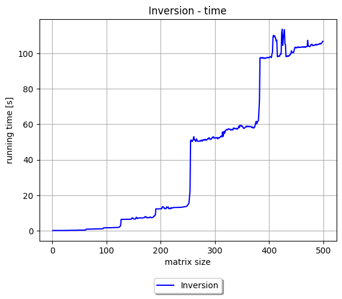

Wykres liczby operacji zmiennoprzecinkowych w zależności od rozmiaru macierzy:
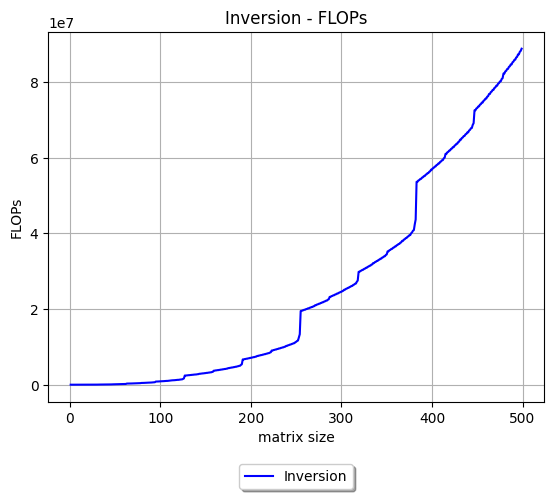

### 6.2 Wykresy dla rekurencyjnej eliminacji Gaussa  <a name="gauss_plot"></a>
Wykres czasu wykonania algorytmu w zależności od rozmiaru macierzy:
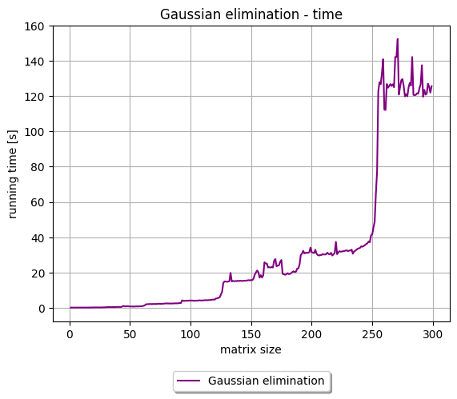

Wykres liczby operacji zmiennoprzecinkowych w zależności od rozmiaru macierzy:
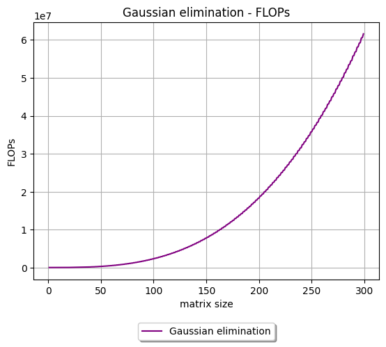
### 6.3 Wykresy dla rekurencyjnej LU faktoryzacji  <a name="lu_plot"></a>
Wykres czasu wykonania algorytmu w zależności od rozmiaru macierzy:
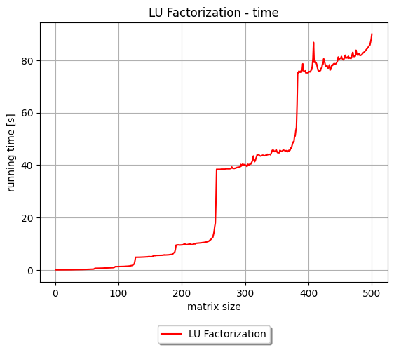

Wykres liczby operacji zmiennoprzecinkowych w zależności od rozmiaru macierzy:
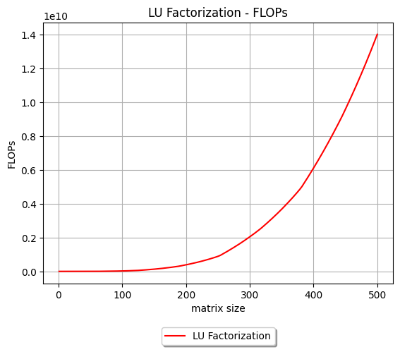

### 6.4 Wykres dla rekurencyjnego obliczania wyznacznika macierzy  <a name="det_plot"></a>
Wykres czasu wykonania algorytmu w zależności od rozmiaru macierzy:
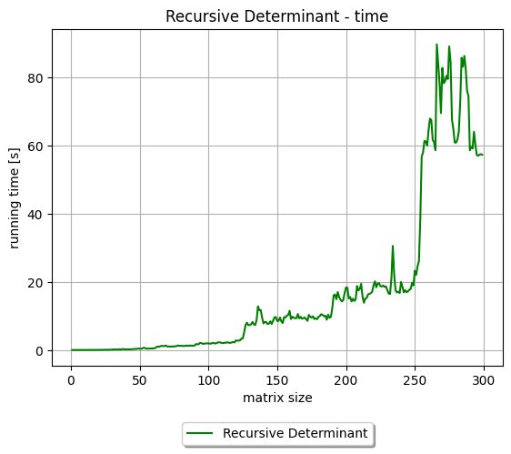

Wykres liczby operacji zmiennoprzecinkowych w zależności od rozmiaru macierzy:


## 7. Szacowanie złożoności obliczeniowej  <a name="complexity"></a>

### 7.1 Algorytm rekurencyjnego odwracania macierzy <a name="inverse-complexity"></a>
Algorytm wykonuje dwa rekurencyjne wywołania dla macierzy o rozmiarze o połowe mniejszym, 7 rekurencyjnych mnożeń macierzy i 4 dodawania/odejmowania/negacje macierzy.
*T(n)* = 2 * *T(n/2)* + *O(n<sup>3</sup>)*
=> *T(n)* = *O(n<sup>3</sup>)*

### 7.2 Eliminacja Gaussa <a name="gauss-complexity"></a>
Algorytm wykonuje jedno rekurencyjne wywołanie dla macierzy A i b o rozmiarze o połowe mniejszym, dwa wywołania rekurencyjnego algorytmu faktoryzacji LU, trzy wywołania rekurencyjnego algorytmu odwracania macierzy, 8 rekurencyjnych mnożeń macierzy i 2 odejmowania macierzy.
*T(n)* = *T(n/2)* + *O(n<sup>3</sup>)*
=> *T(n)* = *O(n<sup>3</sup>)*

### 7.3 Faktoryzacja LU <a name="lu-complexity"></a>
Algorytm wykonuje dwa rekurencyjne wywołania dla macierzy o rozmiarze o połowe mniejszym, dwa wywołania rekurencyjnego algorytmu odwracania macierzy, 3 rekurencyjne mnożenia i 1 odejmowanie macierzy.
*T(n)* = 2 * *T(n/2)* + *O(n<sup>3</sup>)*
=> *T(n)* = *O(n<sup>3</sup>)*

### 7.4 Wyznacznik macierzy <a name="det-complexity"></a>
Algorytm wykonuje jedno wywołanie rekurencyjnego algorytmu faktoryzacji LU, *n* mnożeń liczb zmiennoprzecinkowych.
*T(n)* = *O(n<sup>3</sup>)* + *O(n)*
=> *T(n)* = *O(n<sup>3</sup>)*


## 8. Porównanie wyników z Matlabem <a name="matlab"></a>

Przeprowadziliśmy testy dla poniższej macierzy A oraz wektora b. 

```python
A = [
    [0.54, 0.23, 0.67, 0.12, 0.45],
    [0.78, 0.34, 0.56, 0.91, 0.82],
    [0.13, 0.58, 0.44, 0.73, 0.27],
    [0.89, 0.62, 0.35, 0.29, 0.75],
    [0.48, 0.15, 0.92, 0.64, 0.51]
]

 b = [0.56, 0.23, 0.89, 0.45, 0.67]
```

### 8.1 Odwracanie macierzy  <a name="inversion_matlab"></a>

Dla rekurencyjnego odwracania macierzy otrzymaliśmy wyniki. 

Wyniki otrzymane dla odwracania macierzy w MatLabie:
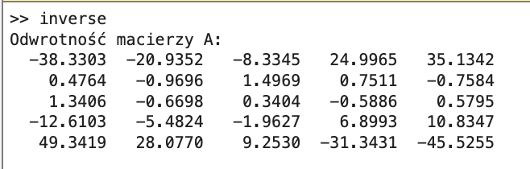

Wyniki otrzymane dla odwracania macierzy z wykorzystaniem własnej implementacji:
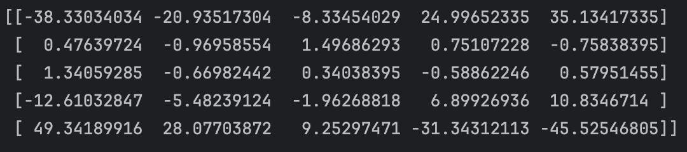


### 8.2 Eliminacja Gaussa  <a name="gauss_matlab"></a>

Wyniki otrzymane dla eliminacji Gaussa w MatLabie:
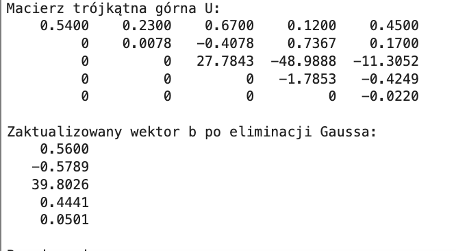

Wyniki otrzymane dla eliminacji Gaussa z wykorzystaniem własnej implementacji:
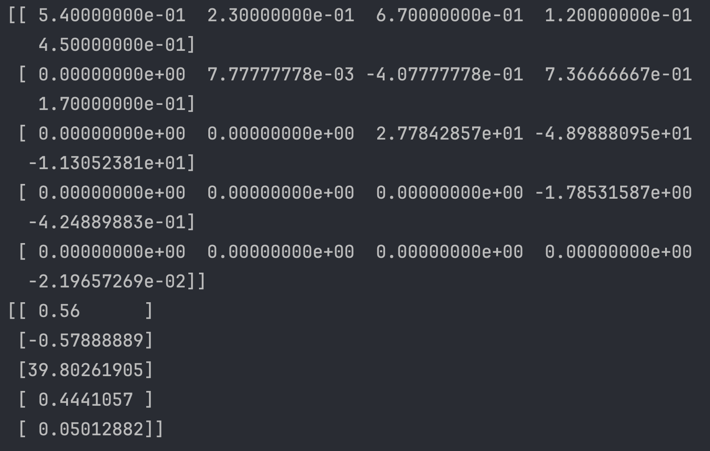


### 8.3 LU Faktoryzacja  <a name="lu_matlab"></a>

Wyniki otrzymane dla faktoryzacji LU w MatLabie:
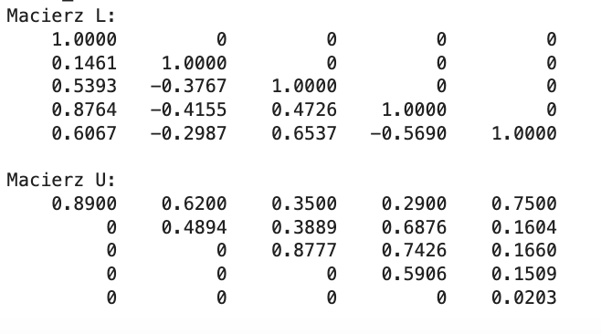

Wyniki otrzymane dla faktoryzacji LU z wykorzystaniem własnej implementacji:
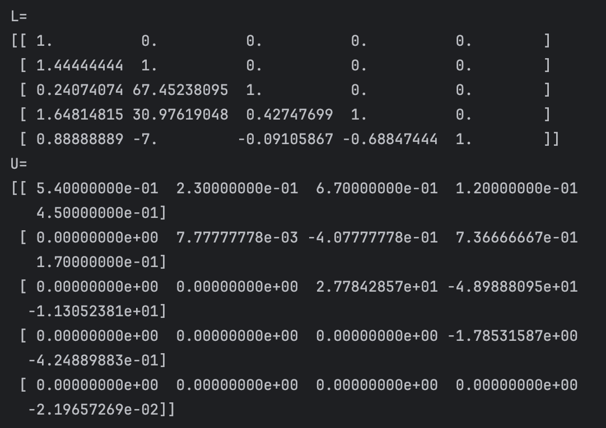


### 8.4 Wyznacznik macierzy  <a name="det_matlab"></a>

Wyniki otrzymane dla wyznacznika macierzy w MatLabie:
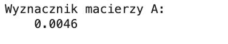

Wyniki otrzymane dla wyznacznika macierzy z wykorzystaniem własnej implementacji:
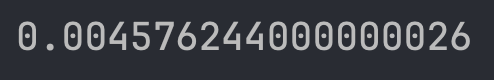

	
## 9. Wnioski  <a name="wnioski"></a>

- Nasze implementacje opierały się na algorytmie mnożenia macierzy *Bineta*, którego implementacja okazała się być skuteczniejsza od algorytmu *Strassena*. Algorytm okazał się być przydatny przy realizacji operacji związanych z odwracaniem macierzy, obliczaniem wyznaczników oraz faktoryzacją LU. 
- Zastosowanie podejścia rekurencyjnego sprawiło, że implementacje były przejrzyste i intuicyjne oraz pozwoliły na rozkładanie problemów na mniejsze, łatwiejsze do przetworzenia bloki. 
- Algorytmy, które zaimplementowaliśmy, wymagały dużej liczby operacji arytmetycznych, co przekładało się na większą złożoność obliczeniową niż w przypadku standardowych funkcji bibliotecznych. 
- Algorytm rekurencyjnego obliczania wyznacznika macierzy produkuje bardzo duże błędy dla macierzy o rozmiarach nie będącymi potęgami 2, ze względu na wykonywanie mnożenia liczb zmiennoprzecinkowych o różnych rzędach wielkości.


## 10. Bibliografia  <a name="biblio"></a>
- Wykłady prof. dr hab. Macieja Paszyńskiego (https://home.agh.edu.pl/~paszynsk/RM/RachunekMacierzowy1.pdf)