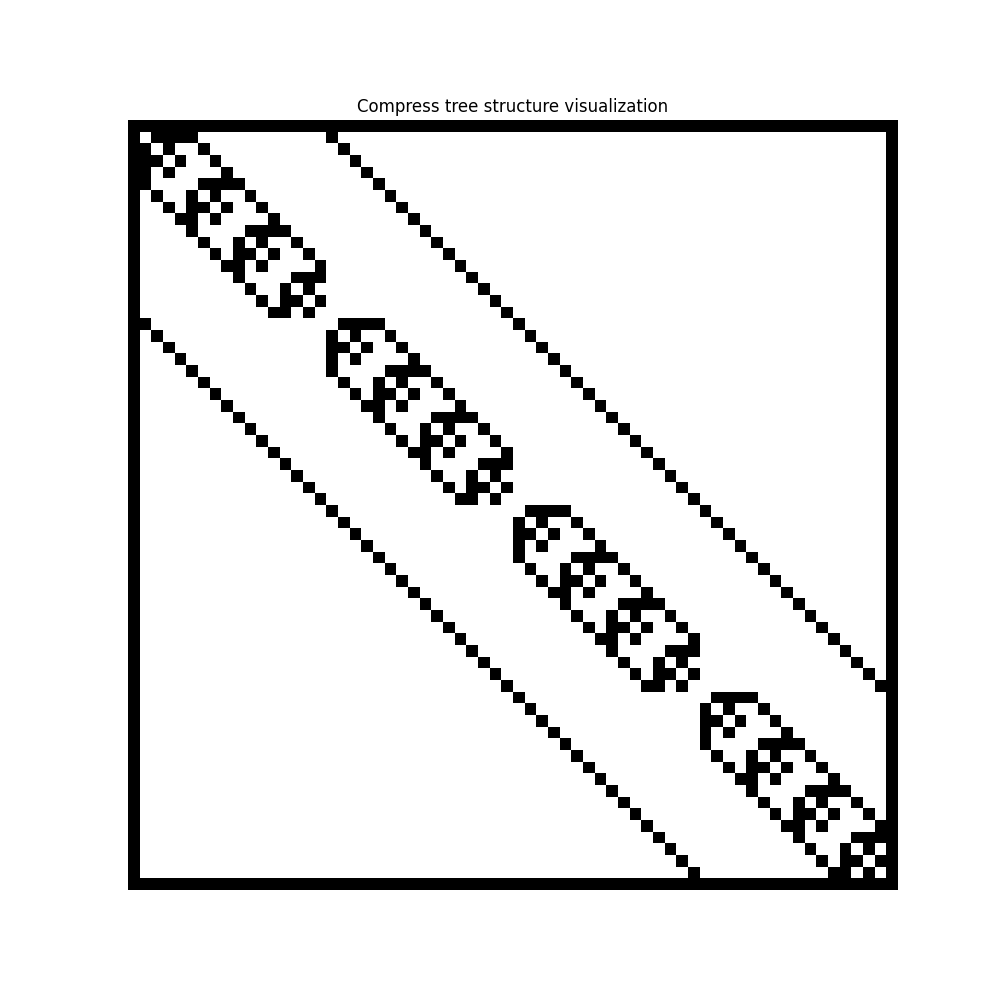
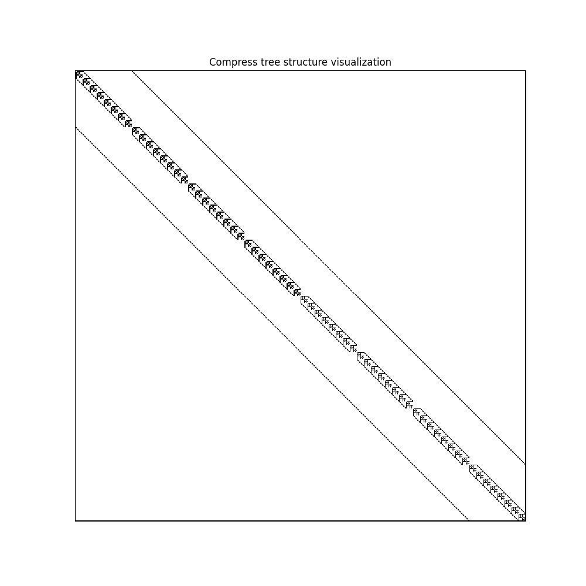
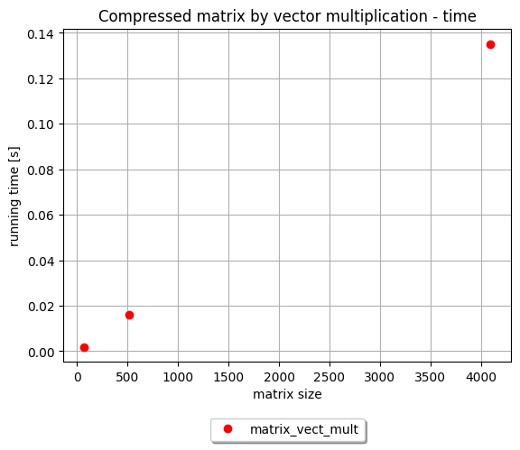
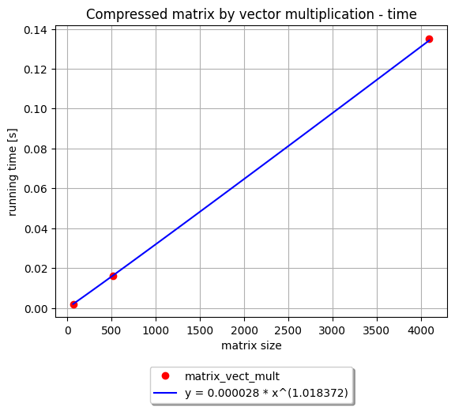
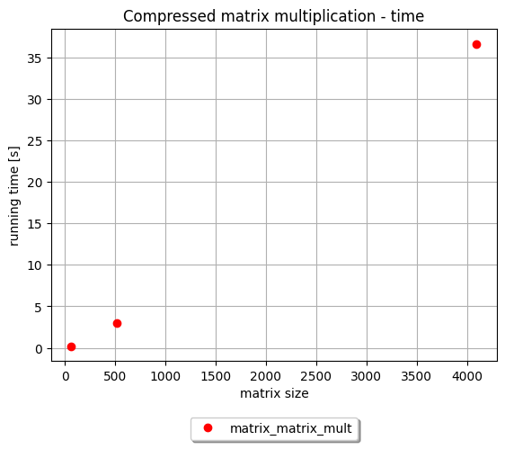
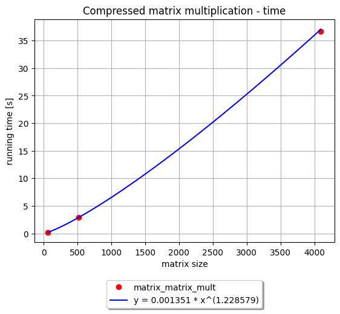

# Algorytmy Macierzowe

## Sprawozdanie nr 4

## 08.01.2025

## Mateusz Król, Natalia Bratek
## gr. 3

## Spis treści
1. [Polecenie](#polecenie)
2. [Generowanie macierzy](#matrix)
	1. [Opis algorytmu](#matrix_opis)
    2. [Pseudokod](#matrix_pseudo)
    3. [Fragment kodu](#matrix_fragment)
    4. [Rysunki](#matrix_rysunki)
3. [Mnożenie macierzy skompresowanej przez wektor](#vector)
    1. [Opis algorytmu](#vector_opis)
    2. [Pseudokod](#vector_pseudo)
    3. [Fragment kodu](#vector_fragment)
    4. [Wykres](#vector_wykres)
    5. [Norma Frobeniusa](#vector_norma)
4. [Mnożenie macierzy skompresowanej przez samą siebie](#mulmatrix)
    1. [Opis algorytmu](#mulmatrix_opis)
    2. [Pseudokod](#mulmatrix_pseudo)
    3. [Fragment kodu](#mulmatrix_fragment)
    4. [Wykres](#mulmatrix_wykres)
    5. [Norma Frobeniusa](#mulmatrix_norma)
5. [Wnioski](#wnioski)


## 1. Polecenie <a name="polecenie"></a>
- Proszę wybrać ulubiony język programowania.
- Proszę wygenerować macierz o rozmiarze 2<sup>3k</sup> dla k = 2, 3, 4
o strukturze opisującej topologię trójwymiarowej
siatki zbudowanej z elementów sześciennych (wiersz =
wierzchołek, niezerowe losowe wartości w kolumnach –
sąsiadujące wierzchołki siatki)
- Proszę użyć rekurencyjną procedurę kompresji macierzy z zadania 3.
- Proszę narysować macierz skompresowaną używając rysowacza z zadania 3
- Proszę przemnożyć macierz skompresowaną przez wektor
- Proszę przemnożyć macierz skompresowaną przez samą siebie

## 2. Generowanie macierzy <a name="matrix"></a>

### 2.1 Opis algorytmu  <a name="matrix_opis"></a>

Algorytm generuje macierz, która reprezentuje topologię trójwymiarowej siatki zbudowanej z elementów sześciennych. Każdy wiersz odpowiada wierzchołkowi, 
a niezerowe wartości w kolumnach wskazują na jego sąsiadujące wierzchołki. Dla każdego punktu algorytm sprawdza czy ma sąsiadów po lewej, prawej, na górze, na dole, 
z przodu i z tyłu.  Jeśli sąsiad istnieje, to odpowiednia komórka w macierzy zostaje wypełniona losową wartością z przedziału od 0.00000001 do 1. W rezultacie, 
otrzymujemy macierz, która zawiera informacje o połączeniach między elementami siatki.


### 2.2 Pseudokod  <a name="matrix_pseudo"></a>

      generate_matrix(k):

         matrix = macierz wypełniona zerami o rozmiarze 2^3k x 2^3k
         a = 0.00000001 
         b = 1.0
         for z od 0 do grid_size – 1:
	        for y od 0 do grid_size – 1:
		       for x od 0 do grid_size – 1:
			      current_idx = z * 2^2k + y * 2^k+ x
			      neighbors = sąsiedzi jako lista krotek:
			      (x - 1, y, z), (x + 1, y, z), (x, y - 1, z), (x, y + 1, z), (x, y, z - 1), (x, y, z + 1)
			      for (nx, ny, nz):
				     if 0 <= nx < 2^k i 0 <= ny < 2^k i 0 <= nz < 2^k:
					    neighbor_idx = nz * 2^2k  + ny * 2^k + nx
					    Ustaw matrix[current_idx, neighbor_idx] na losową wartość z przedziału (a, b)
	
	     return matrix 


### 2.3 Fragment kodu  <a name="matrix_fragment"></a>
```python
import numpy as np

def generate_matrix(k):
    grid_size = 2 ** k
    total_size = grid_size ** 3
    matrix = np.zeros((total_size, total_size), dtype=float)
    a, b = np.double(0.00000001), np.double(1.0)
    for z in range(grid_size):
        for y in range(grid_size):
            for x in range(grid_size):
                current_idx = z * grid_size * grid_size + y * grid_size + x
                neighbors = [(x - 1, y, z), (x + 1, y, z),
                    (x, y - 1, z), (x, y + 1, z),
                    (x, y, z - 1), (x, y, z + 1)]
                for nx, ny, nz in neighbors:
                    if 0 <= nx < grid_size and 0 <= ny < grid_size and 0 <= nz < grid_size:
                        neighbor_idx = nz * grid_size * grid_size + ny * grid_size + nx
                        matrix[current_idx, neighbor_idx] = a + (b-a) * np.random.random()
    return matrix
```
### 2.4 Rysunki <a name="matrix_rysunki"></a>
Rysunki przedstawiają reprezentację skompresowanych macierzy
- r = 1
- epsilon = 1e-7

k = 2


k = 3


k = 4


## 3. Mnożenie macierzy skompresowanej przez wektor <a name="vector"></a>

### 3.1 Opis algorytmu <a name="vector_opis"></a>

Algorytm wykonuje mnożenie macierzy przez wektor. Jeśli węzeł drzewa jest liściem i jeśli ranga liścia jest zerowa,
funkcja zwraca wektor zer o wymiarach zgodnych z wektorem wejściowym X. W przeciwnym razie dokonywane jest mnożenie przez macierz, która 
jest zbudowana z wartości własnych (rozłożenie SVD) tego węzła. Dla węzłów z dziećmi, wektor wejściowy jest dzielony na dwie części, 
które są przekazywane rekurencyjnie dzieciom węzła. Wyniki z tych rekurencyjnych wywołań są sumowane i łączone i otrzymujemy ostateczny wynik mnożenia.

### 3.2 Pseudokod <a name="vector_pseudo"></a>


      matrix_vector_mult(v, X):
	
	     if v nie ma dzieci:
		    if v.rank jest równy 0:
			   return zeros(size(A).rows)
		    return v.U * v.V * X

         rows = size(X).rows	
         Podziel X na dwie części
         X1 = X[1 : rows/2, *]
         X2 =  X[rows/2 + 1 : rows, *]
         Y11 = matrix_vector_mult(v.children(1), X1)
         Y12 = matrix_vector_mult(v.children(2), X2)
         Y21 = matrix_vector_mult(v.children(3), X1)
         Y22 = matrix_vector_mult(v.children(4), X2)

         Złącz wyniki Y11 + Y12 oraz Y21 + Y22 w pionie 
         return wynik

		

### 3.3 Fragment kodu <a name="vector_fragment"></a>
```python
import numpy as np

def matrix_vector_mult(v, X):
    if not v.children:
        if v.rank == 0:
            return np.zeros(X.shape)
        return v.U @ np.diag(v.S) @ (v.V @ X)
    rows = X.shape[0]
    X1 = X[:rows // 2, :]
    X2 = X[rows // 2:, :]
    Y11 = matrix_vector_mult(v.children[0], X1)
    Y12 = matrix_vector_mult(v.children[1], X2)
    Y21 = matrix_vector_mult(v.children[2], X1)
    Y22 = matrix_vector_mult(v.children[3], X2)

    return np.vstack((Y11 + Y12, Y21 + Y22))
```

### 3.4 Wykres <a name="vector_wykres"></a>




### 3.5 Norma Frobeniusa <a name="vector_norma"></a>
Norma została obliczona na podstawie macierzy gęstej i wektora o wartościach z przedziału (0.00000001, 1.0)

| matrix size | Frobenius norm |
|-------------|:--------------:|
| 2           |      0.0       |
| 4           |      0.0       |
| 8           |   1.602e-31    |
| 16          |   3.944e-30    |
| 32          |   2.682e-29    |
| 64          |   3.282e-28    |
| 128         |   1.578e-27    |
| 256         |   1.217e-26    |
| 512         |   1.349e-25    |
	
## 4. Mnożenie macierzy skompresowanej przez samą siebie <a name="mulmatrix"></a>

### 4.1 Opis algorytmu <a name="mulmatrix_opis"></a>

Funkcja matrix_matrix_add służy do dodawania dwóch macierzy. 
Sprawdza, czy jedna z macierzy jest pusta, a w takim przypadku zwraca drugą macierz jako wynik. Jeśli obie macierze są liśćmi drzewa i mają rangę zero, 
zwraca nowy, pusty węzeł. Jeśli obie macierze są liśćmi, ale mają niezerowe rangi, wykonuje na nich dodawanie za pomocą rSVDofCompressed. Jeśli jedna z macierzy 
nie ma dzieci, a druga również nie ma dzieci, funkcja używa split_compressed_matrix do podzielenia tej macierzy, która nie ma dzieci, na mniejsze podmacierze i 
rekurencyjnie dodaje odpowiadające sobie podmacierze.  Funkcja add_rec rekurencyjnie dodaje dwie macierze. Funkcja mult_rec rekurencyjnie mnoży dwie skompresowane macierze. Generuje nowe węzły, które są wynikiem 
mnożenia i sumowania ich poszczególnych podmacierzy. Funkcja matrix_matrix_mult realizuje mnożenie dwóch macierzy. Jeśli jedna z macierzy jest pusta, 
zwracana jest macierz pusta. W przypadku, gdy obie macierze są liśćmi i co najmniej jedna z nich ma rangę zero, zwracana jest również macierz pusta. Gdy obie 
macierze są liśćmi i mają niezerowe rangi, funkcja oblicza nowe macierze U,S i V. Jeśli macierze mają dzieci, funkcja wywołuje siebie rekurencyjnie. Gdy jedna 
z macierzy nie posiada dzieci, a druga posiada dzieci, funkcja używa split_compressed_matrix do podzielenia macierzy bez dzieci na mniejsze podmacierze, a następnie rekurencyjnie mnoży te podmacierze z odpowiadającymi im częściami drugiej macierzy.
Funkcja rSVDofCompressed łączy dwie macierze skompresowane i stosuje zredukowaną dekompozycję wartości osobliwych, a następnie kompresuje wynikową macierz 
do określonej rangi.


### 4.2 Pseudokod <a name="mulmatrix_pseudo"></a>

      add_rec(v, w):
	     node = nowy węzeł CompressTree (None, v.t_min, v.t_max, v.s_min, v.s_max)
	     ustaw node.rank na v.rank
	     for vc in v oraz wc in w:
		    dodaj do node.children wynik matrix_matrix_add(vc, wc)


      matrix_matrix_add(v, w):

	     if v.zeros:
		    return w
	     if w.zeros:
		    return v
	     if v.oraz w nie mają dzieci:
            if v.rank = 0 and w.rank = 0:
               node = nowy węzeł CompressTree (None, v.t_min, v.t_max, v.s_min, v.s_max)
               ustaw node.zeros na true
            if v.rank != 0 and w.rank != 0:
               return rSVDofCompressed(v, w)					
         if v i w mają dzieci:
            return add_rec(v, w)
	     if v nie ma dzieci: 
            Podziel macierz v
            u = split_compressed_matrix(v)
            Rekurencyjnie dodaj odpowiadające sobie segmenty
            return matrix_matrix_add(u, w)
         if w nie ma dzieci:
            Podziel macierz w
            u = split_compressed_matrix(w)
            Rekurencyjnie dodaj odpowiadające sobie segmenty
            return matrix_matrix_add(v, u)
         W przeciwnym przypadku:
            return wynik wywołania add_rec(w, v)

      mult_rec(v, w):
       node = nowy węzeł CompressTree(None, v.t_min, v.t_max, w.s_min, w.s_max)
       Ustaw node.rank na v.rank
       Ustaw node.children jako tablica, gdzie każdy element jest wynikiem dodawania wyników mnożenia odpowiednich dzieci:
           matrix_matrix_add(matrix_matrix_mult(v.children[0], w.children[0]), matrix_matrix_mult(v.children[1], w.children[2]))
           matrix_matrix_add(matrix_matrix_mult(v.children[0], w.children[1]), matrix_matrix_mult(v.children[1], w.children[3]))
           matrix_matrix_add(matrix_matrix_mult(v.children[2], w.children[0]), matrix_matrix_mult(v.children[3], w.children[2]))
           matrix_matrix_add(matrix_matrix_mult(v.children[2], w.children[1]), matrix_matrix_mult(v.children[3], w.children[3]))


      matrix_matrix_mult(v, w):
	     if v.zeros lub w.zeros:
            node = nowy węzeł CompressTree (None, v.t_min, v.t_max, w.s_min, w.s_max)
            Ustaw node.zeros na True
	     if v i w nie mają dzieci:
            if v.rank = 0 lub w.rank = 0:
               node = nowy węzeł CompressTree(None, v.t_min, v.t_max, w.s_min, w.s_max)
               Ustaw node.zeros na True
            W przeciwnym razie:
               Oblicz nowe U, S, V:
               new_U = v.U
               new_S = v.S * w.S
               new_V = (v.V * w.U) * w.V
               node = nowy węzeł CompressTree(None, v.t_min, v.t_max, w.s_min, w.s_max)
               Ustaw liść node z new_U, new_S, new_V
               node.set_leaf(new_U, new_S, new_V)
               Ustaw node.rank na v.rank
        if v i w mają dzieci: 
            return wynik rekurencyjnego wywołania mult_rec(v, w) 
        if v nie ma dzieci:
            u = podzielony v za pomocą split_compressed_matrix(v)
            return wynik matrix_matrix_mult(u, w)	
        if w nie ma dzieci:
             u = podzielony w za pomocą split_compressed_matrix(w)
             return wynik matrix_matrix_mult(v, u)
        W przeciwnym przypadku:
            wywołanie symetryczne
            return matrix_matrix_mult(w, v)  


      rSVDofCompressed(v, w, epsilon):
          n = size(U).rows macierzy v
          k = size(V).columns macierzy v
          original_rank = v.rank
          U_stacked = połącz poziomo macierze U macierzy v i w
          V_stacked = połącz pionowo macierze V macierzy v i w
          S_stacked = połącz wartości S macierzy v i w
          node = nowy węzeł CompressTree(None, 0, n, 0, k)
          Ustaw liść dla node z U_stacked, S_stacked, V_stacked
          node.set_leaf(U_stacked, S_stacked, V_stacked)
          Dekompresuj macierz w node
          node.decompress()
          Skompresuj macierz w node do original_rank z epsilon
          node.compress(original_rank, epsilon)


      split_compressed_matrix(v):
         if v.rank = 1:
            Ustaw S_1 i S_2 na S macierzy v
            S_1 = v.S
            S_2 = v.S
         W przeciwnym razie:
            Podziel S macierzy v na dwie połowy
            S_1 = v.S[: liczba_wierszy / 2]
            S_2 = v.S[liczba_wierszy / 2 :]    
          Podziel U macierzy v poziomo na dwie równe części
          U_upper = v.U[: liczba_wierszy / 2, :] 
          U_lower = v.U[liczba_wierszy / 2 :, :]
          Podziel V macierzy v pionowo na dwie równe części
          V_left =  v.V[:, : liczba_kolumn / 2] 
          V_right = v.V[:, liczba_kolumn / 2 :]    
          node = now węzeł CompressTree(None, v.t_min, v.t_max, v.s_min, v.s_max)    
          Inicjalizuj dzieci node na [None, None, None, None]
    
          Utwórz i ustaw dzieci węzła node:
           node.children[0] = nowy węzeł CompressTree(None, v.t_min, v.t_min + U_upper.rows, v.s_min, v.s_min + V_left.columns)
           Ustaw liść dla dziecka 0
           node.children[0].set_leaf(U_upper, S_1, V_left)	

           node.children[1] = nowy węzeł CompressTree(None, v.t_min, v.t_min + U_upper.rows, v.s_min + V_left.columns, v.s_max)
           Ustaw liść dla dziecka 1 
           node.children[1].set_leaf(U_upper, S_2, V_right)

           node.children[2] = nowy węzeł CompressTree(None, v.t_min + U_upper.rows, v.t_max, v.s_min, v.s_min + V_left.columns)       
           Ustaw liść dla dziecka 2 
           node.children[2].set_leaf(U_lower, S_1, V_left)
    
           node.children[3] = nowy węzeł CompressTree(None, v.t_min + U_upper.rows, v.t_max,
                        v.s_min + V_left.columns, v.s_max)        
           Ustaw liść dla dziecka 3
           node.children[3].set_leaf(U_lower, S_2, V_right)


	

### 4.3 Fragmenty kodu <a name="mulmatrix_fragment"></a>

```python
import numpy as np
from src.algorithms.compression.compress_tree import CompressTree


def rSVDofCompressed(v, w, epsilon=1e-7):
    n, k = v.U.shape[0], v.V.shape[1]
    original_rank = v.rank
    U_stacked = np.hstack((v.U, w.U))
    V_stacked = np.vstack((v.V, w.V))
    S_stacked = np.concatenate((v.S, w.S))
    node = CompressTree(None, 0, n, 0, k)
    node.set_leaf(U_stacked, S_stacked, V_stacked)
    node.matrix = node.decompress()
    node.compress(original_rank, epsilon)
    return node


def add_rec(v, w):
    node = CompressTree(None, v.t_min, v.t_max, v.s_min, v.s_max)
    node.rank = v.rank
    node.children = [matrix_matrix_add(vc, wc) for vc, wc in zip(v.children, w.children)]
    return node


def matrix_matrix_add(v, w):
    if v.zeros:
        return w
    if w.zeros:
        return v
    if not v.children and not w.children and v.rank == 0 and w.rank == 0:
        node = CompressTree(None, v.t_min, v.t_max, v.s_min, v.s_max)
        node.zeros = True
        return node
    if not v.children and not w.children and v.rank != 0 and w.rank != 0:
        return rSVDofCompressed(v, w)
    if v.children and w.children:
        return add_rec(v, w)
    if not v.children:
        return matrix_matrix_add(split_compressed_matrix(v), w)
    if not w.children:
        return matrix_matrix_add(v, split_compressed_matrix(w))
    return add_rec(v, w)


def mult_rec(v, w):
    node = CompressTree(None, v.t_min, v.t_max, w.s_min, w.s_max)
    node.rank = v.rank
    node.children = [
        matrix_matrix_add(
            matrix_matrix_mult(v.children[0], w.children[0]),
            matrix_matrix_mult(v.children[1], w.children[2])),
        matrix_matrix_add(
            matrix_matrix_mult(v.children[0], w.children[1]),
            matrix_matrix_mult(v.children[1], w.children[3])),
        matrix_matrix_add(
            matrix_matrix_mult(v.children[2], w.children[0]),
            matrix_matrix_mult(v.children[3], w.children[2])),
        matrix_matrix_add(
            matrix_matrix_mult(v.children[2], w.children[1]),
            matrix_matrix_mult(v.children[3], w.children[3]))]
    return node


def matrix_matrix_mult(v, w):
    if v.zeros or w.zeros:
        node = CompressTree(None, v.t_min, v.t_max, w.s_min, w.s_max)
        node.zeros = True
        return node
    if not v.children and not w.children:
        if v.rank == 0 or w.rank == 0:
            node = CompressTree(None, v.t_min, v.t_max, w.s_min, w.s_max)
            node.zeros = True
            return node
        new_U = v.U
        new_S = v.S * w.S
        new_V = (v.V @ w.U) @ w.V
        node = CompressTree(None, v.t_min, v.t_max, w.s_min, w.s_max)
        node.set_leaf(new_U, new_S, new_V)
        node.rank = v.rank
        return node
    if v.children and w.children:
        return mult_rec(v, w)
    if not v.children:
        return matrix_matrix_mult(split_compressed_matrix(v), w)
    if not w.children:
        return matrix_matrix_mult(v, split_compressed_matrix(w))
    return matrix_matrix_mult(w, v)


def split_compressed_matrix(v) -> CompressTree:
    if v.rank == 1:
        S_1 = v.S
        S_2 = v.S
    else:
        S_1 = v.S[:v.S.shape[0] // 2]
        S_2 = v.S[v.S.shape[0] // 2:]
    U_upper = v.U[:v.U.shape[0] // 2, :]
    U_lower = v.U[v.U.shape[0] // 2:, :]
    V_left = v.V[:, :v.V.shape[1] // 2]
    V_right = v.V[:, v.V.shape[1] // 2:]
    node = CompressTree(None, v.t_min, v.t_max, v.s_min, v.s_max)
    node.rank = v.rank
    node.children = [None for _ in range(4)]
    node.children[0] = CompressTree(None, v.t_min, v.t_min + U_upper.shape[0], v.s_min,
                                    v.s_min + V_left.shape[1])
    node.children[0].rank = v.rank
    node.children[0].set_leaf(U_upper, S_1, V_left)
    node.children[1] = CompressTree(None, v.t_min, v.t_min + U_upper.shape[0],
                                    v.s_min + V_left.shape[1], v.s_max)
    node.children[1].rank = v.rank
    node.children[1].set_leaf(U_upper, S_2, V_right)
    node.children[2] = CompressTree(None, v.t_min + U_upper.shape[0], v.t_max, v.s_min,
                                    v.s_min + V_left.shape[1])
    node.children[2].rank = v.rank
    node.children[2].set_leaf(U_lower, S_1, V_left)
    node.children[3] = CompressTree(None, v.t_min + U_upper.shape[0], v.t_max,
                                    v.s_min + V_left.shape[1], v.s_max)
    node.children[3].rank = v.rank
    node.children[3].set_leaf(U_lower, S_2, V_right)
    return node
```

### 3.4 Wykres <a name="mulmatrix_wykres"></a>





### 3.5 Norma Frobeniusa <a name="mulmatrix_norma"></a>
Norma została obliczona na podstawie macierzy gęstych o wartościach z przedziału (0.00000001, 1.0)

| matrix size | Frobenius norm |
|-------------|:--------------:|
| 2           |   4.930e-32    |
| 4           |   6.163e-32    |
| 8           |   2.798e-30    |
| 16          |   8.761e-29    |
| 32          |   2.029e-27    |
| 64          |   5.119e-26    |
| 128         |   1.593e-24    |
| 256         |   4.656e-23    |
## 5. Wnioski  <a name="wnioski"></a>

- Czas wykonania mnożenia macierzy przez wektor rośnie prawie liniowo wraz ze wzrostem rozmiaru macierzy.
- Normy Frobeniusa dla mnozenia macierzy przez wektor są bardzo niskie. To może sugerować wysoką dokładność algorytmu.
- Czas wykonania mnożenia macierzy przez samą siebie rośnie nieliniowo
- Normy Frobeniusa dla mnożenia macierzy przez samą siebie są dalej bardzo niskie dla różnych rozmiarów macierzy. 


